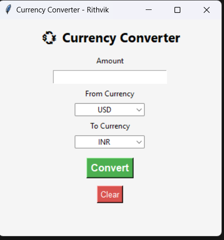

# Currency Converter - Python GUI App 💱

This is a simple and interactive desktop currency converter built using Python and Tkinter.  
It fetches real-time exchange rates using ExchangeRate-API and lets you convert between major currencies.

## 🛠 Tech Used
- Python 3
- Tkinter (GUI)
- Requests (for API)
- ExchangeRate-API

## 🚀 Features
- Real-time currency conversion
- Clean and user-friendly GUI
- Support for multiple currencies
- Reset/Clear function
- Basic error handling

## ▶ How to Run
1. Clone this repo or download the files.
2. Open a terminal in the project folder.
3. Install `requests` if not installed:
4. Run the app:

## 📸 Screenshot

## 🔗 API Used
[ExchangeRate-API](https://www.exchangerate-api.com/)

## 👨‍💻 Author
Rithvik Reddy Gudipati  
CodeClause Python Development Intern (June 2025)
